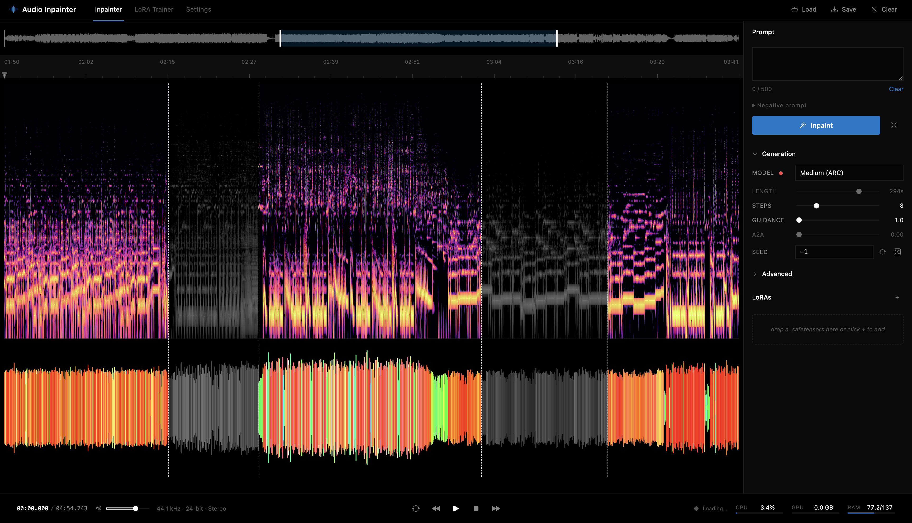

# sa3-inpainter-ui

Browser UI for [Stable Audio 3](https://github.com/Stability-AI/stable-audio-3) — inpainting, text-to-audio, audio-to-audio, LoRA training with live charts, dataset auto-captioning, and inference speedups. Runs on CUDA (Linux/WSL) and Apple Silicon (MPS + MLX decoder, native MLX LoRA training).



Upstream: [Stability-AI/stable-audio-3](https://github.com/Stability-AI/stable-audio-3) · [stabilityai/stable-audio-3-medium on HF](https://huggingface.co/stabilityai/stable-audio-3-medium)

### Features

- **Inpainting** — paint directly on the spectrogram to select regions, then regenerate with a text prompt
- **Text-to-audio** — generate up to 380s of audio from a prompt
- **Audio-to-audio** — vary existing audio with controllable strength
- **LoRA Trainer tab** — dedicated two-pane UI: dataset manager (drag-drop audio, mini-spectrogram thumbnails, per-file caption popovers) on the left, training config + live metrics on the right
- **Auto-captioning** — caption your whole dataset with Gemini 3 Pro / Flash via OpenRouter. Few-shot examples in Settings define style; cost estimate + running spend shown live; cancel anytime; sends full songs (not 30s clips) so cinematic intros don't poison the genre tag
- **Live training charts** — 2×2 sparkline grid (loss, grad norm, cpu/gpu %, ram/vram) below the progress bar. Per-step loss + grad-norm pushed in real-time, wandb-style synced hover cursor across all four charts with value tooltips
- **Test System** — runs a few real training steps (with dummy latents if not yet pre-encoded) to measure ms/step + peak overhead, then extrapolates total training time. Result cached per-LoRA + per-config
- **Pre-training advisory** — live warnings for low data, overfit/undertrain risk, lr sanity, missing captions, etc. Surfaces problems without blocking — your judgment, not the UI's
- **LoRA training** — train LoRAs from the UI with auto batch sizing, pre-encoded latents (with cancel + clear-cache), and torch.compile support. Model auto-unloads during training to fit in 24GB VRAM. Native MLX training on Apple Silicon (medium DiT, full attention via MLX fused SDPA — the flash-attn equivalent on Apple Silicon). DoRA / LoRA / LoRA-XS / BoRA adapter variants
- **Per-LoRA persistence** — every LoRA folder remembers its own rank, steps, batch, lr, compile, trigger word, and last Test System profile across page refreshes. Currently-edited LoRA is restored on reload
- **State survives tab switches** — leaving and returning to the Trainer tab during a long run rebuilds the full chart history + elapsed timer from the backend in a single poll
- **LoRA inference** — stack multiple LoRAs with per-LoRA strength sliders and trigger words
- **Textual inversion** — train and apply custom text embeddings
- **Multi-model** — switch between medium, medium-base, small-music, small-sfx. Auto-downloads from HF
- **Inference speedups** — KV cache, token merging (ToME), exit layer early-out, RES4LYF exponential RK samplers
- **Advanced controls** — CFG interval, APG scale, distribution shift, scale phi, memory token strength
- **VAE decode quality** — FP32 decode toggle, configurable overlap for chunked decoding
- **Precision** — runtime FP16/FP32 switching
- **Waveform** — per-latent frequency-colored waveform with ghost overlay for past inpaints
- **Interaction** — scroll zoom anchored at cursor, shift-scroll pan, click-to-scrub playhead, lowpass + duck on playback over masked regions
- **Settings** — dedicated tab with paths (models, LoRAs, training, embeddings, SA3 root), HF + OpenRouter API keys, captioner model + parallelism + few-shot examples, adapter type. First-run setup prompts automatically
- **System stats** — live CPU, GPU VRAM, and RAM usage in the bottom bar (1s poll)
- **BPM** — auto-detection and tempo change
- **Keyboard shortcuts** — `?` to view all shortcuts
- **Undo/redo** — full history for mask and audio changes
- **Export** — save/download current audio

### Doesn't have (yet)

Per-region prompts · streaming per-step diffusion previews · multi-track · frequency-bounded selections · stretching

## Install

Requires Python 3.11+ and Node.js.

```bash
# clone with SA3 as a dependency
git clone https://github.com/lyramakesmusic/sa3-inpainter-ui.git
cd sa3-inpainter-ui

# python deps
uv sync

# for LoRA training (optional)
uv pip install pytorch_lightning==2.5.5 dill wandb

# frontend deps
cd webui && npm install && cd ..
```

SA3 model weights are gated — accept the license at [HuggingFace](https://huggingface.co/stabilityai/stable-audio-3-medium), then either:

- Set your HF token in the **Settings** tab and models auto-download on first use
- Or manually: `huggingface-cli download stabilityai/stable-audio-3-medium --local-dir ~/sa3-inpainter/models/stable-audio-3-medium`

For LoRA training, you also need the [stable-audio-3 source repo](https://github.com/Stability-AI/stable-audio-3) cloned locally — set the path in Settings.

## Run

```bash
# backend on :5174 — ~30s to load the model
uv run python backend/server.py

# frontend on :5173 — Vite proxies /api → :5174
cd webui && npm run dev
```

Open http://localhost:5173. On first launch you'll be prompted to fill in paths and tokens in the **Settings** tab.

## Configuration

All paths are configurable from the **Settings** tab in the top bar:

| Setting                  | Default                         | Description                                                                   |
| ------------------------ | ------------------------------- | ----------------------------------------------------------------------------- |
| Models directory         | `~/sa3-inpainter/models`        | SA3 model weights                                                             |
| LoRA directory           | `~/sa3-inpainter/loras`         | Trained LoRA files                                                            |
| LoRA training directory  | `~/sa3-inpainter/lora_training` | Per-LoRA working directory (audio, latents, per-LoRA settings JSON)           |
| Embeddings directory     | `~/sa3-inpainter/embeddings`    | Textual inversion embeddings                                                  |
| SA3 source root          | _(empty)_                       | Path to stable-audio-3 repo clone (needed for training — `optimized/mlx` tree)|
| HuggingFace token        | _(empty)_                       | For gated model downloads                                                     |
| OpenRouter API key       | _(empty)_                       | For auto-captioning via Gemini 3 Pro / Flash                                  |
| Autocaptioner model      | `pro`                           | `pro` (higher accuracy, ~$0.012/track) or `flash` (cheaper, ~$0.010)          |
| Autocaptioner parallel   | `32`                            | Number of concurrent caption requests                                         |
| Autocaptioner examples   | _(3 defaults)_                  | Few-shot caption examples that define output style                            |
| LoRA adapter             | `dora-rows`                     | Adapter architecture: `lora` / `dora-rows` / `dora-cols` / `bora`             |

Settings can also be set via environment variables: `SA3_MODELS_DIR`, `SA3_LORA_DIR`, `SA3_LORA_TRAIN_DIR`, `SA3_EMBED_DIR`. Settings are saved to `~/.config/sa3-inpainter/settings.json`; per-LoRA training settings + cached profile results go to `<lora_training_dir>/<name>/train_settings.json`; captioner cost history goes to `~/.config/sa3-inpainter/captioner_stats.json`.

---

## Architecture

```
backend/server.py               FastAPI app, model lifecycle, inference, training/captioning orchestration, all /api routes
backend/captioner.py             Async OpenRouter caption pool + per-call cost tracking
backend/train_lora.py            LoRA training subprocess wrapper (CUDA)
backend/train_lora_compiled.py   torch.compile monkey-patch for training
backend/pre_encode.py            Pre-encode audio to latents for faster training
backend/kv_cache.py              Cross-attention KV cache for inference speedup
backend/tome.py                  Token merging (ToME) for inference speedup
mlx_sa3/ae.py                    MLX AE decoder (Apple Silicon)
mlx_sa3/nn_blocks.py             Transformer + differential attention + band-mask SWA
mlx_sa3/weights.py               Safetensors to MLX weight remap
mlx_sa3/lora.py                  MLX LoRA/DoRA/BoRA adapter injection + weight save/load
mlx_sa3/train_lora_mlx.py        MLX LoRA training loop with per-step grad-norm logging
mlx_sa3/pre_encode_mlx.py        MLX audio-to-latent pre-encoding
webui/src/lib/session.svelte.js  Shared reactive state + API client
webui/src/lib/MainCanvas.svelte  Spectrogram + paint + zoom interaction
webui/src/lib/SpecCanvas.svelte  Canvas-based STFT spectrogram (Web Worker, reassignment)
webui/src/lib/WaveformOverlay.svelte  Per-latent frequency-colored waveform overlay
webui/src/lib/TrainerView.svelte Dataset manager + training config + live metric charts
webui/src/lib/SparkLine.svelte   Canvas sparkline w/ axis ticks + synced hover cursor
webui/src/lib/SettingsView.svelte Settings tab (paths, API keys, captioner, adapter)
webui/src/lib/Toast.svelte       Selectable error/success toasts
webui/src/lib/RightRail.svelte   Right sidebar: prompt, generation, LoRA, advanced controls
webui/src/lib/BottomBar.svelte   Transport, system stats
webui/src/App.svelte             Layout + audio graph + playback wiring + tab routing
```
